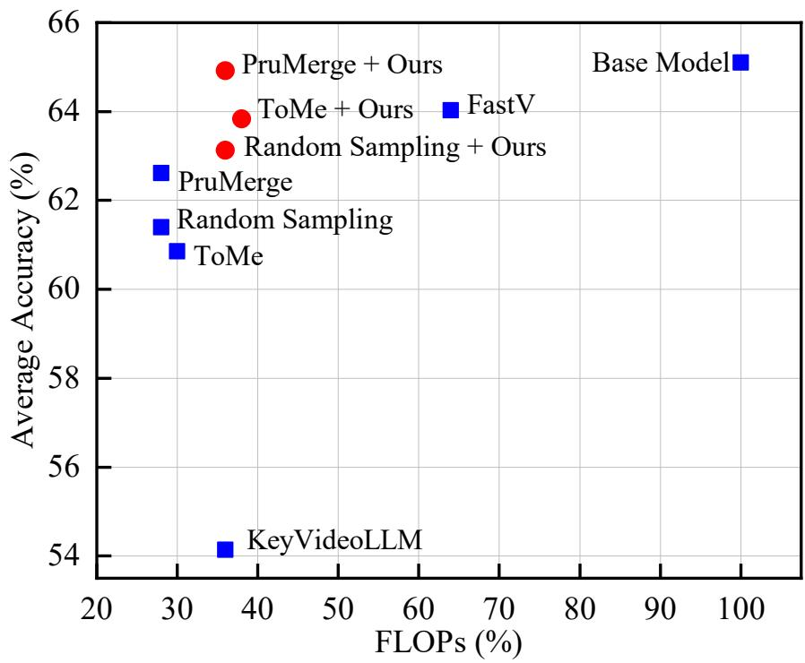
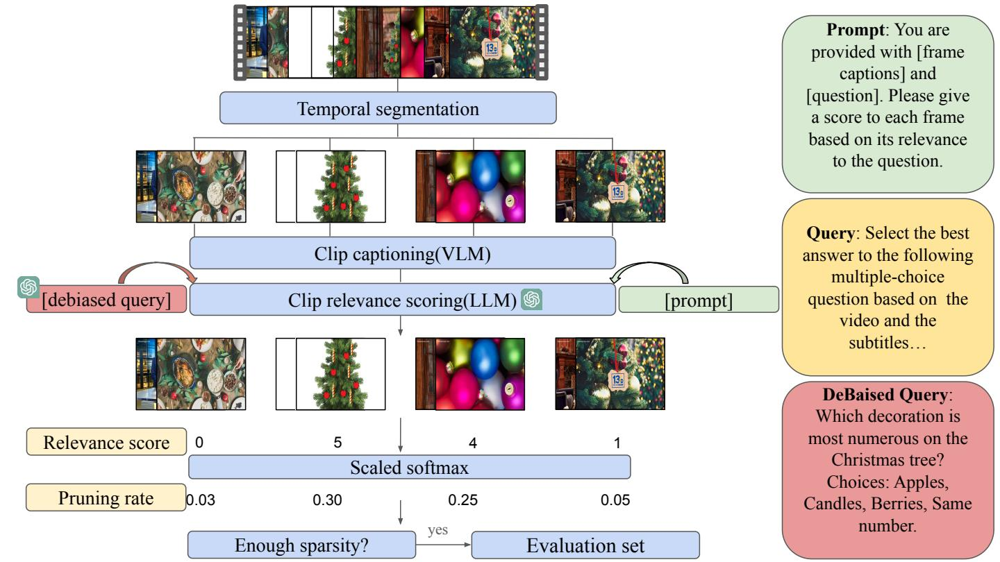
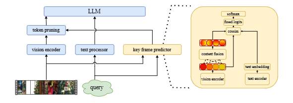

<!-- ---------- HERO SECTION ---------- -->
<style>
/* quick local styles — move to assets/css later if you like */
.hero      { text-align:center; margin:60px 0 80px; }
.hero h1   { font-size:3.3rem; font-weight:700; line-height:1.1; margin:0 0 1rem; }
.hero p    { margin:0.25rem 0; font-size:1.15rem; }
.hero .btn {
  display:inline-block; padding:0.6rem 1.7rem; margin:0.4rem 0.25rem;
  border-radius:2rem; background:#1e1e1e; color:#fff; text-decoration:none;
  font-size:1rem; font-weight:500;
}
.hero .btn:hover { background:#444; }
</style>

<div class="hero">
  <h1>Keyframe-oriented Vision Token Pruning:<br>
      Enhancing Efficiency of Large Vision-Language Models<br>
      on Long-Form Video Processing</h1>

  <p>Yudong&nbsp;Liu<sup>1</sup>, Jingwei&nbsp;Sun<sup>1</sup>, Yueqian&nbsp;Lin<sup>1</sup>, 
     Jingyang&nbsp;Zhang<sup>1</sup>, Ming&nbsp;Yin<sup>1</sup>, Qinsi&nbsp;Wang<sup>1</sup>, 
     Jianyi&nbsp;Zhang<sup>1</sup>, Hai&nbsp;Li<sup>1</sup>, Yiran&nbsp;Chen<sup>1</sup></p>
  <p><sup>1</sup>Duke University · <em>ICCV 2025 (accepted)</em></p>

  <a class="btn" href="https://arxiv.org/abs/2503.10742" target="_blank">📄 Paper</a>
  <a class="btn" href="https://github.com/1999Lyd/KVTP/tree/main" target="_blank">💻 Code</a>
</div>


## 🚀 News  
**July 2025:** *Keyframe-oriented Vision Token Pruning: Enhancing Efficiency of Large Vision-Language Models on Long-Form Video Processing* has been **accepted at ICCV 2025**! 🎉

---

## Abstract
Vision-language models (VLMs) demonstrate strong capabilities in jointly processing visual and textual data. However, they often incur substantial computational overhead due to redundant visual information, particularly in long-form video scenarios. Existing approaches predominantly focus on either vision token pruning, which may overlook spatio-temporal dependencies, or keyframe selection, which identifies informative frames but discards others, thus disrupting contextual continuity.

We propose **KVTP (Keyframe-oriented Vision Token Pruning)**, a novel framework that overcomes the drawbacks of token pruning and keyframe selection. By **adaptively assigning pruning rates based on frame relevance to the query**, KVTP effectively retains essential contextual information while significantly reducing redundant computation. To thoroughly evaluate long-form video understanding capacities of VLMs, we curated and reorganized subsets from seven datasets into a unified benchmark that highlights real-world scenarios with sparse but crucial events.

Experiments on VLMs of various scales show that KVTP can **reduce token usage by 80 %** while maintaining spatio-temporal and contextual consistency—cutting computation without sacrificing performance.

---



---

## Method

### SKV-QA Dataset Construction  
We build **SKV-QA**, a training & evaluation benchmark for sparse-event, long-video QA by combining 7 open-source datasets (VideoMME, EgoSchema, NeXT-QA, …).



### Frame Relevance Predictor & Token Pruning  
A lightweight **frame relevance predictor** is trained on SKV-QA and can be plugged into any existing token-pruning pipeline.



---

## Results

### LLaVA-Video-7B

| Method | FLOPs | VideoMME | EgoSchema | NeXT-QA |
|--------|------:|---------:|----------:|--------:|
| LLaVA-Video-7B | **×100 %** | **62.63** | **54.17** | **78.51** |
| Random Sampling | ×36 % | 58.28 | 50.69 | 75.66 |
| ToMe | ×38 % | 59.21 | 51.83 | 72.49 |
| PruMerge | ×36 % | 59.97 | 52.76 | 75.88 |
| KeyVideoLLM | ×36 % | 51.32 | 46.78 | 64.33 |
| FastV | ×64 % | 61.79 | 52.42 | 77.89 |
| **Random Sampling + KVTP** | ×36 % | 60.16 | 52.73 | 76.50 |
| **ToMe + KVTP** | ×38 % | 62.36 | 53.24 | 75.88 |
| **PruMerge + KVTP** | ×36 % | 63.29 | 54.71 | 76.76 |

### LLaVA-Video-72B

| Method | FLOPs | VideoMME | EgoSchema | NeXT-QA |
|--------|------:|---------:|----------:|--------:|
| LLaVA-Video-72B | **×100 %** | **69.52** | **65.76** | **83.20** |
| Random Sampling | ×23 % | 62.57 | 60.55 | 79.03 |
| ToMe | ×23 % | 62.93 | 61.34 | 76.52 |
| PruMerge | ×23 % | 64.62 | 63.20 | 80.89 |
| KeyVideoLLM | ×23 % | 60.49 | 55.23 | 76.45 |
| FastV | ×56 % | 66.25 | 63.56 | 80.34 |
| **Random Sampling + KVTP** | ×23 % | 64.32 | 62.19 | 80.12 |
| **ToMe + KVTP** | ×23 % | 65.77 | 63.61 | 79.51 |
| **PruMerge + KVTP** | ×23 % | 67.34 | 64.12 | 81.21 |

---

## Qualitative Examples


---

## Citation

```bibtex
@inproceedings{liu2025kvtp,
  title     = {Keyframe-oriented Vision Token Pruning: Enhancing Efficiency of Large Vision-Language Models on Long-Form Video Processing},
  author    = {Liu, Yudong and Sun, Jingwei and Lin, Yueqian and Zhang, Jingyang and Yin, Ming and Wang, Qinsi and Zhang, Jianyi and Li, Hai and Chen, Yiran},
  booktitle = {Proceedings of the IEEE/CVF International Conference on Computer Vision (ICCV)},
  year      = {2025}
}


